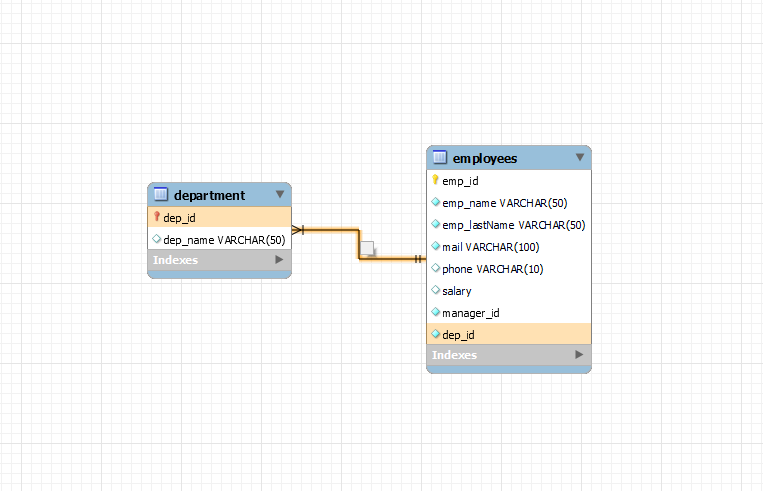
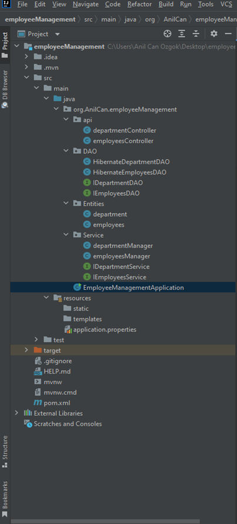

# employeeManagementSystem
An employee management system (only back-end) project for internship program.

# Details
Creating the only back-end side of the employee management system that has personal information of the employees (such as name, surname, mail, phone number, etc.), their departments, and the managers of these departments. System must update and delete these informations. This is a Spring Boot MVC project. Using MySql as a database and Maven as a project management tool.

# Database
- Database diagram was created and data added into it.

# Layers in back-end side
- Entity, Data Access and Service layers were created and interfaces implemented to these layers.

